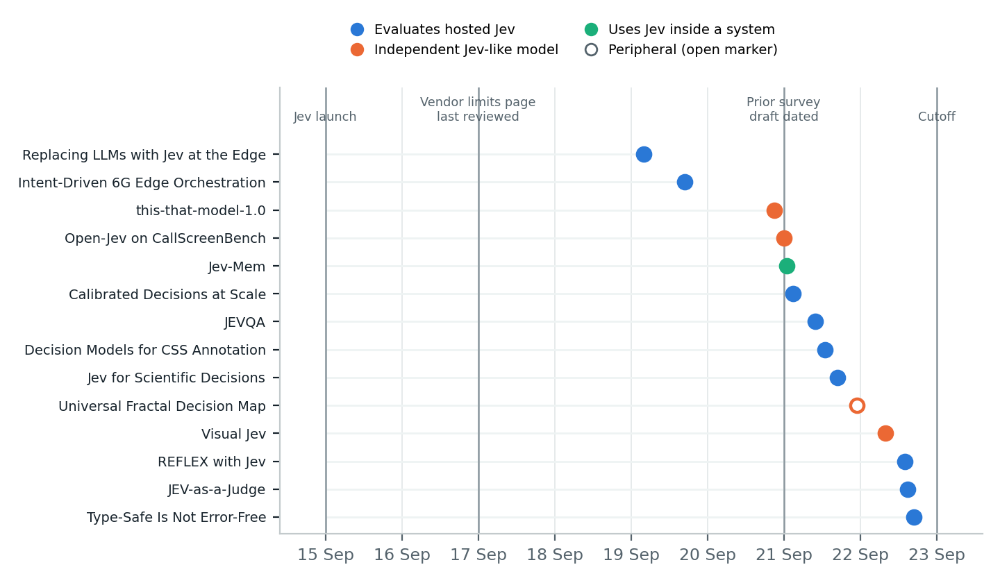
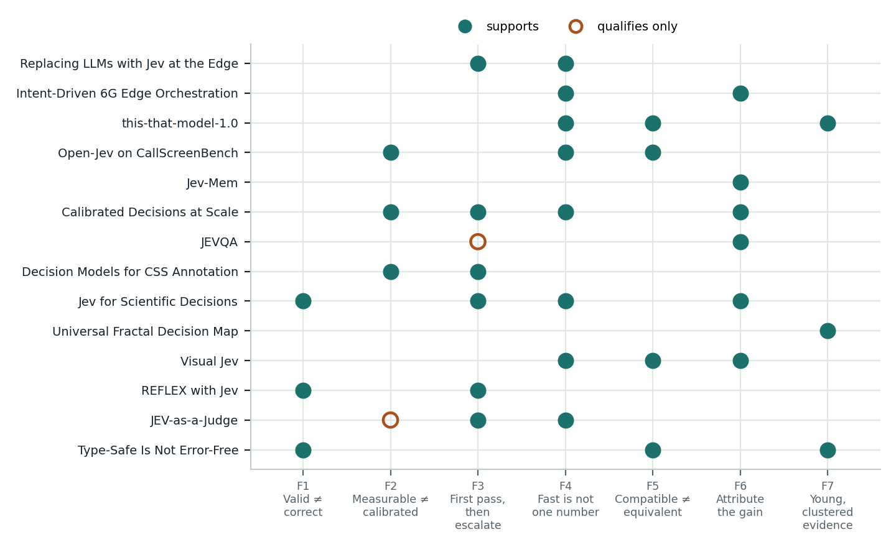
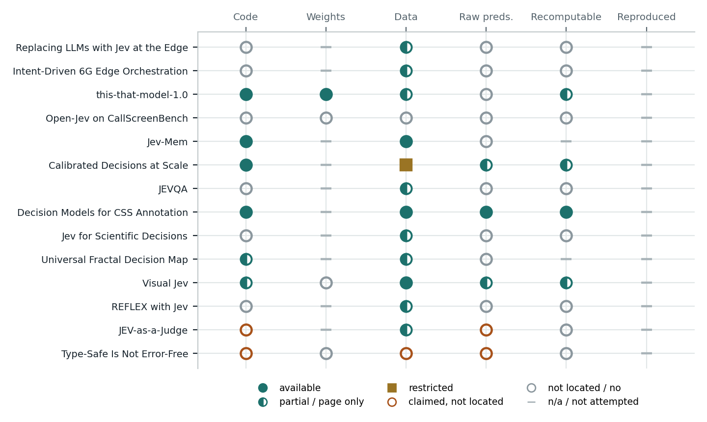

<!-- Generated by scripts/build-paper.py from paper/src/survey.src.md and data/*.json. Edit the source, then rebuild. -->

# Jev and Typed Decision Models: An Empirical Survey of Calibration, Selective Control, and Open Implementations

*[Meng Luo](https://eurekaleo.github.io/) · Draft 0.1.0 · Data cutoff 23 Sep 2026 · Not peer-reviewed*

> **Abstract.** In September 2026 TypeSafe AI released Jev, a hosted "System One" model that answers typed questions about a text state with a probability distribution over declared options instead of generated text. Within a week a first wave of preprints evaluated it, built open alternatives and embedded it in judges, agents, annotation pipelines and edge systems. We review this evidence as it stood on 23 Sep 2026: 13 core studies, 1 peripheral study and 53 background references, extracted into 62 claim-level evidence records with locators, measurement scopes and sample sizes, plus an openness audit of 30 implementation and evaluation resources. Seven findings emerge. A type-valid answer can still be wrong: rebinding option names to rubrics lowered hosted Jev's AUROC from .8146 to .5806 with zero type errors. A native probability makes calibration measurable, not guaranteed: reliability varies by task and construct, and recalibration on held-out labels helps. The most consistent use is a cheap first pass with confidence-gated escalation, whose value depends on thresholds set on separate data and on strong cheap baselines. Speed and cost figures come from incompatible measurement scopes. Open implementations reproduce the interface through at least six non-equivalent mechanisms, none of which establishes the commercial architecture. System-level gains need module-level attribution. And the evidence is young, clustered and unreplicated. We contribute a versioned evidence base, a synthesis that keeps incomparable numbers apart, an implementation and openness audit, and a proposed evaluation protocol. We compare the work with a prior public survey draft and make no priority claim.

## Introduction

Many software decisions are small and bounded: route a ticket, accept or escalate a judgment, pick the next tool, code a variable from a narrative. Large language models can make such decisions, but they return strings that must be parsed, validated and retried, and their stated confidence is usually a verbalised estimate rather than a probability the program can threshold [[1](#ref-1), [2](#ref-2)]. Typed decision models change the contract. The caller declares the admissible answers; the model returns one of them together with a probability for every option; no free text is generated, so a parse failure is impossible by construction.

TypeSafe AI's Jev, released in early access on 15 September 2026, made this contract prominent [[3](#ref-3)]. Its launch materials describe a "new class of frontier models" optimised with "Reinforcement Learning for Calibrated Decisions" and report end-to-end responses of 70–500 ms at $0.042 per million input tokens [[3](#ref-3), [4](#ref-4)]. Between 19 and 22 September 2026, thirteen arXiv preprints evaluated Jev, built open Jev-like models, or used typed decisions inside larger systems. The claims in this literature range from schema validity to calibration, cost, latency and end-task success; the measurement protocols range from 20 curated scientific choices to 499,500 crash narratives.

A public survey draft, *Decisions, Not Tokens*, dated 21 September 2026, already places typed decisions in the history of classification, calibration, selective prediction and routing, and proposes a five-dimensional taxonomy and four evaluation layers [[5](#ref-5)]. Its bibliography at the pinned commit contains none of the thirteen core preprints reviewed here. This survey therefore does something different: it is an **empirical survey and evidence audit** of the first wave, organised so that incomparable numbers stay apart.

We keep three objects distinct throughout: (A) the **commercial model**, TypeSafe's hosted Jev, whose architecture and training data are undisclosed; (B) the **paradigm**, Jev-like typed decision models and readouts built by others; and (C) **systems** whose results depend on typed decisions. A result about one is not evidence about another.

We ask six questions. **RQ1 (definition and lineage):** how do runtime-defined finite-option decisions relate to classifiers, zero-shot labelling, rerankers, reward models and constrained generation? **RQ2 (probability quality):** what do returned probabilities and confidence mean, and where do they hold? **RQ3 (efficiency attribution):** how much of a speed or cost gain comes from the readout, and how much from model size, batching, prefix sharing, caching or the network? **RQ4 (selective control):** which decisions can be delegated, and when should software escalate, abstain or defer to code? **RQ5 (robustness):** how do option names, order, rubric binding, missing options, language and distribution shift change decisions? **RQ6 (openness):** what do alternatives release, and how much of the literature survives a common protocol?

Our contributions are concrete artefacts rather than claims of priority:

1. A versioned evidence base of 67 references and 62 evidence records. Each record carries a source locator, evidence type, test level, measurement scope, sample size and model version, with explicit reasons where a value is missing (§3).
2. A synthesis into seven findings, each listing supporting *and* qualifying evidence (§7). Study families are synthesised once, and nothing is pooled across incompatible scopes.
3. An implementation lineage of six readout families and an openness audit that separates code, weights, data, raw predictions, recomputability and reproduction (§6, §9).
4. A catalogue of failure modes with sources and mitigations (§8), and a proposed evaluation protocol whose first experiment targets the intersection of name binding, calibration and escalation (§10).
5. A public website, generated README, BibTeX and CSV exports, all produced from the same data by scripts with validation and link checks.

## Scope, definitions and what is documented

### The interface

A caller sends a `state` (a string, JSON object or array of text values) and a map of typed questions; the model evaluates every question independently against the shared state and returns one answer per question [[6](#ref-6), [7](#ref-7)]. Three primitives exist. A **Choice** selects among named options, each defined by a description; the answer includes the chosen option, a probability for every option and a `confidence` value. The launch post states support for up to 255 options, with a two-stage procedure for high cardinality [[3](#ref-3)]. A **Score** places the answer on two to ten ordered, described levels; it returns a position that may fall between levels, probabilities per level and `confidence`. The vendor warns against interpolating exact magnitudes from it [[8](#ref-8)]. A **Noul** returns the probability that a yes/no proposition holds and carries no separate confidence [[7](#ref-7), [9](#ref-9)].

At the cutoff the documented model was `jev-1.13.0`. The aliases `jev-latest` and `jev-preview` both pointed to it, and the vendor advises pinning the versioned ID when thresholds are tuned to a version [[4](#ref-4)]. Input is text only; images, audio and video must first be converted to text or structured fields, and English is the primary training language [[4](#ref-4), [6](#ref-6)]. Visual Jev and JEVQA, discussed below, do not change this: one is an independent model and the other feeds text features to hosted Jev.

### Probability semantics

Probabilities and confidence are different objects. The documentation defines `confidence` as a statistic computed from the returned distribution and recommends thresholds tested on the user's own data [[9](#ref-9)]. The exact statistic is not specified in prose; an interactive demo on the documentation page computes a normalised maximum probability and labels it as how *that demo* computes confidence. We therefore do not treat the demo formula as the production implementation. Empirically, one study found that native confidence ranked items almost exactly like the maximum label probability (Spearman 0.948–0.999) [[10](#ref-10)]. The vendor also states that calibration is measured across groups of predictions and does not guarantee that an individual answer is correct [[11](#ref-11)]. Two independent sources observe that probabilities are returned on a 0.01 grid, which bounds calibration error for rare events from below and can put exactly zero on a correct answer [[12](#ref-12), [13](#ref-13)].

### What is not disclosed

The launch post names a new architecture, a parallel sampler and the RLCD training method, and the documentation says one set of weights serves every account without per-customer fine-tuning [[3](#ref-3), [4](#ref-4)]. The architecture, training data and objective are not published. Community reconstructions exist; Kev, for example, follows an architecture described in a third-party blog post. They remain speculation and are not evidence about the commercial model [[14](#ref-14)].

### Vendor claims as hypotheses

The headline "193.6× faster, 444.6× cheaper" comes from the vendor's workflow evaluations. Their reference answers average two external frontier models; the vendor expects the gains to be at the high end of real-world use and notes that its own capabilities team wrote the workflows [[3](#ref-3)]. The plotted 0% type-error rate is described as analytical rather than empirical, and latency figures were measured from the vendor's West Coast laptops [[3](#ref-3)]. We record these as vendor claims, not as evaluations.

### Names that collide

Several names mean different things. TypeSafe's *System One* borrows Kahneman's System 1 metaphor, but System 1/2 reasoning literature predates the product and is broader [[15](#ref-15)]. *RLCD* in the Jev context expands to Reinforcement Learning for Calibrated Decisions and is unrelated to RLCD, Reinforcement Learning from Contrastive Distillation (2023); one core study makes the same distinction [[16](#ref-16)]. *OpenJev* names three different things: the former name of SemIf (a frozen-decoder readout), a DiffusionGemma server, and the "Open-Jev" of one paper's title (JevLite) [[17](#ref-17), [18](#ref-18), [19](#ref-19)]. *Visual Jev* is independent research, not a TypeSafe release [[20](#ref-20)]. One repository called a "synthetic survey" is a questionnaire experiment [[21](#ref-21)]. Adjacency in name implies neither the same algorithm nor copying.

## Review method

### Search

The snapshot of 23 September 2026 ran 17 accepted arXiv API queries. They returned 225 hits and 197 unique records after de-duplication by unversioned arXiv ID (Appendix A). Queries combined the brand and interface vocabulary (`jev`, `typesafe`, "System One", "typed decision", "calibrated decisions") with open-model names, survey terms and a date-bounded "decision model" query. The last matters: arXiv `all:` searches metadata rather than full text, and it found a core study that brand-name queries missed [[16](#ref-16)]. One compound query reported 1,232,608 results and was stopped by rate limiting; it was rejected rather than screened and replaced by narrow title/abstract queries. Six background references came from these queries and 38 more were retrieved by explicit ID as a purposive seed for theory and baselines.

A same-day increment re-ran all 17 queries. The totals were identical. It then added 19 expansion queries on interface vocabulary and open-model names; four were rejected by rule because the API parsed their phrases so loosely that they returned thousands of records. It screened 128 new records by title and abstract and added 9 as background references. No new core study appeared, which is expected: arXiv announces new submissions around 00:00 UTC. For repositories, five GitHub searches produced 1,082 unique discovery results. From these we audited 81 catalogues and research guides (79 READMEs at pinned commits) and 30 priority implementation and evaluation resources. The 4,666 outgoing links found in catalogue READMEs are kept as unverified candidates and never counted as projects.

### Eligibility

A study is **core** if it evaluates TypeSafe Jev, a clearly identified Jev-like typed-decision implementation, or a system whose contribution materially depends on such decisions. **Peripheral** studies fall within reach of the scope but rest on contested, self-reported claims; they stay visible but are not pooled. **Background** references are adjacent methods with a stated role. We excluded name matches (Japanese encephalitis, JEPA, unrelated uses of "TypeSafe", other expansions of RLCD) and generic System 1/2 work without a typed-decision link.

### Reading depth and extraction

We read the core and peripheral studies in full, checking key tables and limitation sections. Background references were checked against metadata and abstracts; one reranker paper was spot-checked in full [[22](#ref-22)]. Repository evidence comes from READMEs at pinned commits and 12 source files read in 10 repositories. Nothing was executed and no experiment was re-run.

Each checkable statement became an evidence record. A record stores its subject, text, headline and source locator, and an evidence type: author-reported experiment, vendor documentation, vendor-reported result, community report, or code/README inspection. It also stores the metric, value and baseline; the sample size, model version and hardware, each with a reason when unknown; the **test level** (model test, system test, hybrid, simulation); and the **measurement scope** (single request, amortized per question, batch, end to end, simulation, author estimate, vendor claim). Each record links to the findings of §7 as *supporting* or *qualifying* evidence. Openness is recorded as six independent fields per study: code visible, weights available, data available, raw predictions available, recomputable, independently reproduced.

### Synthesis and its limits

Tasks, metrics, binning and scopes are heterogeneous, so we pool nothing and rank nothing. Findings are stated at the strength their records allow, with qualifying records listed beside supporting ones. The two edge-orchestration studies share authors and a service path, so they form one study family [[23](#ref-23), [24](#ref-24)]. The review was carried out by one AI-assisted reviewer and is not a registered or PRISMA-compliant systematic review; §12 lists what this implies.

## Related surveys and positioning

*Decisions, Not Tokens* treats machine-native decision models broadly, from classical classifiers to Jev [[5](#ref-5)]. It offers an operational definition, a five-dimensional taxonomy (output contract, inference mechanism, learning objective, uncertainty interface, system control), four evaluation layers and a fair replication protocol. We adopt its separation of structural validity, semantic correctness, probabilistic reliability and decision utility, and credit it for that framing. The differences are empirical and procedural. At its pinned commit the draft lists search sources and keyword families but publishes no query log or screening decisions, and it cites none of the thirteen core preprints. Its failure analysis is conceptual, and its figures are labelled conceptual illustrations. This survey adds the evidence records, a synthesis that keeps scopes apart, an implementation and openness audit, and a data pipeline that regenerates every table. A dimension-by-dimension comparison is maintained in the repository (`docs/related-surveys.md`). Because both documents are working drafts, the comparison describes pinned versions and may change.

Adjacent surveys cover uncertainty quantification and calibration in LLMs [[2](#ref-2)], the move from System 1 to System 2 reasoning [[15](#ref-15)], efficient reasoning under budgets [[25](#ref-25)] and decision-focused learning [[26](#ref-26)]. None of them addresses typed decision APIs. Community catalogues and evidence guides helped with discovery but are not evidence in themselves.

## Lineage and an analytical frame

### Lineages

Typed decisions recombine long-standing ideas. **Discriminative classification** with bidirectional encoders [[27](#ref-27), [28](#ref-28)], few-shot classifiers [[29](#ref-29)] and generalist lightweight classifiers [[30](#ref-30), [31](#ref-31)] are the natural baselines, and zero-shot labelling via label descriptions anticipated runtime-defined options [[32](#ref-32)]. Task-agnostic discriminative modules [[33](#ref-33)] and domain probabilistic decision systems such as SalesRLAgent [[34](#ref-34)] predate the product. They establish context, not shared architecture or priority. **Calibration** and temperature scaling [[35](#ref-35)] and the failure of calibration under shift [[36](#ref-36)] frame every probability claim, alongside the gap between models' self-knowledge and verbalised confidence [[1](#ref-1)], semantic uncertainty [[37](#ref-37)] and RL-trained confidence expression [[38](#ref-38)]. **Selective prediction** [[39](#ref-39), [40](#ref-40)], learning to defer [[41](#ref-41)] and conformal methods [[42](#ref-42), [43](#ref-43)] supply the theory of acting on confidence. Decision-aware calibration measures what matters downstream [[44](#ref-44), [45](#ref-45), [46](#ref-46), [47](#ref-47)]. **Structured output** research shows that constrained decoding guarantees validity but not semantics [[48](#ref-48), [49](#ref-49), [50](#ref-50)], that prefix sharing and scheduling yield their own speed-ups [[51](#ref-51)], and that schema compliance and forced forms need their own benchmarks [[52](#ref-52), [53](#ref-53), [54](#ref-54)]. **Judges and reward models** [[55](#ref-55), [56](#ref-56), [57](#ref-57)], **routing and cascades** [[58](#ref-58), [59](#ref-59), [60](#ref-60), [61](#ref-61)] and **label and format sensitivity** [[62](#ref-62), [63](#ref-63), [64](#ref-64)] complete the background.

### Five places a claim can live

We read each study by where its claim sits on the path from a declared question to a workflow outcome (Table 1). This is an analytical organisation for comparing evidence. It is not the internal architecture of any model, and we do not claim it as the first such taxonomy.

**Table 1.** Five places a claim can live: an analytical organisation, not a model architecture.

| Stage | Question | Evidence to look for | Studies |
| --- | --- | --- | --- |
| Decision contract | What exactly is being asked, and what may the answer be? | Type validity; name and order invariance; closed-set failure when the right option is missing. | 5 |
| Inference & readout | How is a distribution over the declared options produced? | Same-backbone ablations; readout geometry; what is and is not disclosed. | 5 |
| Probability & calibration | What does a returned probability or confidence mean, and for which population? | Per-task reliability, high-confidence errors, recalibration on held-out labels. | 5 |
| Selective control | When should software act, ask, escalate or abstain? | Coverage at fixed risk; escalation rate; thresholds chosen on a separate selection set. | 5 |
| Downstream use | Does the whole workflow get better, cheaper or faster? | System-level baselines; module attribution; matched measurement scope. | 12 |

## Implementation families

Implementations share the request and response shape, not the mechanism that produces the probabilities. We distinguish six families by their readout (Table 2).

**Table 2.** Six readout families. Compatible interfaces do not imply equivalent mechanisms.

| Family | Principle | Public | Boundary |
| --- | --- | --- | --- |
| Hosted System One service | A closed, hosted model returns a distribution over declared options for each typed question about a shared text state. | Interface, primitives, pricing, limits, versioning and known failure modes are documented; architecture, training data and the exact confidence statistic are not. | Black-box evaluation only; the served model can change behind aliases; text-only input. |
| Encoder decision heads | A bidirectional encoder reads state, question and options together; a head scores each option and a softmax is taken over the legal set. | Weights and inference code for Laya; the readout geometry (marker token vs span mean) changes name sensitivity. | Short context windows; option-name polarity can dominate the rubric; adjacent to GLiClass, SetFit and NLI zero-shot classifiers. |
| Frozen decoder option readout | An unmodified causal LM is prompted once and the next-token logits of single-token option labels are renormalised over the declared options. | Fully open and training-free; the natural low-cost baseline for any trained decision model. | Raw logits are order-sensitive and poorly calibrated without correction; label tokenisation matters. |
| Fine-tuned decoder decision models | A decoder is adapted (LoRA or full fine-tuning) so that a designated position or pointer head yields calibrated option probabilities in one pass. | Several release weights, training code and evaluation data; lineages exist (this-that-model is adapted from decider-2b). | Gains may come from task coverage in training; derived checkpoints are not independent methods. |
| Diffusion structured readout | A discrete diffusion LM is seeded with the answer template; after one denoising step, the distribution at each answer slot is read directly. | Open servers with a Jev-compatible wire API; depends on request extensions proposed in an unmerged vLLM PR. | A different mechanism from last-token decoder readout; custom entropy-based confidence. |
| Generative & constrained adapters | A general LLM is asked (often under JSON-schema constraints) to emit a decision and probabilities, which are validated and returned in Jev-shaped responses. | Wire compatibility for controlled comparisons; probabilities are generated or verbalised, not read from logits. | Interface compatibility is not mechanism equivalence; retries, parsing and self-reported probabilities remain. |

**Hosted service.** TypeSafe's Jev documents its interface, prices, limits, versions and known failure modes. It is observable only as a black box that can change behind aliases.

**Encoder decision heads.** Laya uses ModernBERT-large and mmBERT-base checkpoints with a router and reports 33 ms per question on a T4 in its README [[65](#ref-65)]. The option-binding study audits two open encoder heads, one scoring a marker token and one mean-pooling the option span, and shows that readout geometry sets how much the option name can matter [[66](#ref-66)].

**Frozen decoder readouts.** SemIf reads option-token probabilities from an unmodified open model and states that it reproduces the interface pattern, not Jev's model or training [[17](#ref-17)]. AnyJev adds label-free permutation calibration. For a frozen Qwen3-8B on BANKING77 (n = 300) it reports that flips under option reversal fall from 0.230 to 0.073 and that the share of items decidable at ≤5% error rises from 7.7% to 52.0% with 100–500 labels [[67](#ref-67)]. These training-free readouts are the natural low-cost baseline for any trained decision model.

**Fine-tuned decoder models.** Kev (0.8B–9B, Qwen3.5 with LoRA and a pointer head), decider (Qwen3.5 2B/4B/35B), this-that-model-1.0 (adapted from decider-2b), NanoJev (0.6B), Bespoke Nimble (9B), JevLite and Visual Jev train a decoder so that a designated position yields calibrated option probabilities in one pass [[14](#ref-14), [68](#ref-68), [69](#ref-69), [70](#ref-70), [71](#ref-71), [19](#ref-19), [20](#ref-20)]. Two same-backbone ablations locate the gain. JevLite's two-label readout decides 4.9× faster than the same Qwen3-4B fine-tuned to generate its answer [[19](#ref-19)]. In Visual Jev, a matched typed head brings no consistent accuracy advantage over reading the LM head [[20](#ref-20)]. Derived checkpoints are not independent methods: this-that-model's own paper records its lineage from decider-2b and its reuse of NanoJev's recorded cohort [[69](#ref-69)].

**Diffusion structured reads.** djev and OpenJev seed a discrete diffusion model's canvas with the answer template and read each answer slot after one denoising step. They rely on request extensions proposed in an unmerged vLLM pull request and define their own confidence [[72](#ref-72), [18](#ref-18)].

**Generative adapters.** TypeSafe's official adapter routes typed questions to general LLM APIs for comparisons [[73](#ref-73)]. LocalJev asks a model for JSON probabilities, then validates, retries and normalises them; its README calls the result wire-compatible but "not mathematically equivalent" to a logit read [[74](#ref-74)].

The implication for RQ1 and RQ6 is direct. The interface can be reproduced by at least six mechanisms whose probabilities mean different things, and none of them reveals how the commercial model works.

## Evidence synthesis

### The evidence base

The thirteen core studies appeared over four days, beginning four days after the launch (Figure 1). Relationships overlap: 10 studies evaluate or use hosted Jev, 5 build or evaluate independent Jev-like models, and 6 embed typed decisions in a larger system (Table 3). Of the 11 studies that query hosted Jev, 8 state the version they called (`jev-1.13.0` or `jev-1.13`; one uses `typesafe/jev1.13` through OpenRouter [[16](#ref-16)]) and 3 state none. Every core study is an arXiv v1 preprint.

**Figure 1.** Submission dates of the core and peripheral studies (arXiv v1) against context events, by primary relationship to Jev.

**Table 3.** Core and peripheral studies (* peripheral; † same study family). Headline values are author-reported.

| Study | v1 (2026) | Test level | Version | Headline (as reported) | Ref. |
| --- | --- | --- | --- | --- | --- |
| Replacing LLMs with Jev at the Edge † | 09-19 | Hybrid | jev-1.13 | Median client decision latency −15.9% to −26.5% | [[24](#ref-24)] |
| Intent-Driven 6G Edge Orchestration † | 09-19 | Hybrid | Jev 1.13 | Median decision latency −22.4% vs DeepSeek, −61.9% vs Gemini | [[23](#ref-23)] |
| this-that-model-1.0 | 09-20 | Model test | 1.0; not reported | 30.9 ms per decision on one laptop GPU; 32 decisions/s | [[69](#ref-69)] |
| Open-Jev on CallScreenBench | 09-21 | Model test | paper v1 (three seeds) | JevLite ensemble AUROC .974, ECE .052; no false alarms | [[19](#ref-19)] |
| Jev-Mem | 09-21 | System test | not reported | LoCoMo judge 0.777 (+11.0%); build 158 s; 0.93 s/query | [[75](#ref-75)] |
| Calibrated Decisions at Scale | 09-21 | System test | jev-1.13.0 | 499,500 narratives screened for $25.23; 195,857 fully coded | [[12](#ref-12)] |
| JEVQA | 09-21 | Model test | jev-1.13 | PLCC vs VMAF: 0.737 (metadata) → 0.824 (+bitstream, pixel) | [[76](#ref-76)] |
| Decision Models for CSS Annotation | 09-21 | Model test | typesafe/jev1.13 | Behind best LLM on 14/15 tasks (−11.6 F1) at 44× lower cost | [[16](#ref-16)] |
| Jev for Scientific Decisions | 09-21 | System test | Jev 1.13 | Full semantic correctness; median 0.335 s, p95 0.442 s | [[77](#ref-77)] |
| Universal Fractal Decision Map * | 09-21 | Model test | not reported | Self-reported 92.6% macro-accuracy, 7.08 ms on CPU, “#1” on JevBench | [[78](#ref-78)] |
| Visual Jev | 09-22 | Model test | paper v1 | Macro accuracy 0.706 → 0.761 after post-training (seen families) | [[20](#ref-20)] |
| REFLEX with Jev | 09-22 | System test | jev-1.13.0 | 95% success with 1.12 strong calls/task vs 88% and 4.10 (−72.7%) | [[79](#ref-79)] |
| JEV-as-a-Judge | 09-22 | Model test | jev-1.13.0 | RewardBench 92.2% vs 93.5%; HaluEval 87.5% vs 86.7% (GPT-6) | [[10](#ref-10)] |
| Type-Safe Is Not Error-Free | 09-22 | Model test | not reported | Hosted Jev AUROC .8146 → .5806 after name–rubric swap; 0% type errors | [[66](#ref-66)] |

### F1 · A type-valid answer can still be the wrong answer

Typed interfaces remove parse and schema failures by construction, and nothing more. In the most direct test, the authors held question, state, rubric wording and the set of option names fixed and changed only which name was bound to which rubric [[66](#ref-66)]. For hosted Jev, rebinding the rubrics behind *no/yes* flipped 32.50% of answers, against 2.08% and 1.67% under neutral names. It lowered balanced accuracy from .7127 to .5163 and AUROC from .8146 to .5806 on 1,200 items. The swap produced 24× the model's test–retest floor, while the type-error rate stayed at 0% in every condition. The larger reversal in the abstract, AUROC .9376 → .2315, belongs to an open marker-readout head, not to Jev. That head is also where neutral renaming of multi-way options changed 52.42% of answers. Random character-string names returned flip rates to the neutral regime without costing accuracy, which suggests that polarity, not naming itself, drives the effect. Community audits add closed-set and primitive effects. Removing an abstain option drove accuracy on unanswerable items from 0.950 to 0.000 at 0.79 confidence, and a Noul and a two-option Choice over the same question differed by 0.125 on average [[80](#ref-80)]. In a synthetic-panel study, the choice of primitive reversed a comparison with GPT-4.1 [[21](#ref-21)]. In agents, reliability depends on the size of the action set and on near-valid alternatives near authorisation boundaries [[79](#ref-79)]. In scientific workflows, wrong selections changed derived counts while the final label stayed correct [[77](#ref-77)]. The vendor's own list of weaknesses — literal reading, arithmetic, dates, indirection, large irrelevant state and adversarial text — points the same way [[8](#ref-8)].

Two qualifications matter. Order is a different intervention from binding: one community audit saw no argmax flips in 400 order permutations on hosted Jev [[80](#ref-80)], whereas frozen open readouts are order-sensitive until calibrated [[67](#ref-67)]. And the mitigations the authors propose (neutral identifiers, randomised names in training) have not been evaluated. Related work outside the Jev literature reaches the same conclusion from other directions: schema descriptions act as prompts [[64](#ref-64)], forced forms invite invented answers [[54](#ref-54)], and tool-using agents fail by binding the right action to the wrong entity [[81](#ref-81)].

### F2 · A native probability makes calibration measurable, not guaranteed

Every call returns a distribution, so reliability can be audited on each run. Measured reliability varies. Across 15 computational-social-science tasks, Jev's median ECE was 0.157 (95% CI 0.108–0.233). That beat the verbalised confidence of 16 of 19 LLMs but not three frontier Claude models (best 0.066) [[16](#ref-16)]. The same study shows how a global average hides a local failure: on empathy in peer-support dialogues the model was confident while near chance, a task ECE of 0.538. On crash narratives, probabilities ranked well but overstated prevalence. Recalibration fitted on half of 2,416 blinded human judgments cut calibration error by about 3.3×, and calibration varied by model rather than by paradigm [[12](#ref-12)]. Community audits disagree across datasets. One pre-registered audit found ECE 0.0204 on CLINC150 and 0.0936 on Banking77 [[82](#ref-82)]. Another found that a temperature of about 3.4 was needed on a task whose rule is not recoverable from the text [[13](#ref-13)]. A third found that a Spanish state cost 3.0–6.4 accuracy points and doubled ECE on the hardest tasks [[83](#ref-83)]. Open models show the same pattern: JevLite reaches calibration error .052 with a temperature-scaled two-label readout, but on synthetic calls and with a recipe chosen under test-set exposure [[19](#ref-19)].

The qualifications are specific. Native confidence is essentially the maximum probability [[10](#ref-10)], and the vendor presents calibration as a group property [[11](#ref-11)]. The probabilities are quantised to two decimals [[12](#ref-12)]. The background literature explains the rest: calibration degrades under shift [[36](#ref-36)]; the ranking of confidence signals changes out of domain [[84](#ref-84)]; answer-preserving attacks can move confidence readouts [[85](#ref-85)]; and conformal certificates can fail under a change in how scores are produced [[86](#ref-86)]. Calibration is therefore a property to verify per workload and per construct, with recalibration on held-out target labels. It is not a certificate.

### F3 · A bounded first pass with confidence-gated escalation

Across judging, annotation and agent control, the typed model is usually the cheapest and fastest component, and rarely the most accurate. As a judge, Jev stayed within three points of the strongest comparator (GPT-6 Astra) on ordinary preference and evidence-grounded factuality: 92.2% vs 93.5% on RewardBench and 87.5% vs 86.7% on HaluEval. A frozen two-order cascade kept 99% of the comparator's accuracy at 57% of its fee [[10](#ref-10)]. In agent control, a Jev-gated agent reached 95% success with 1.12 strong-model calls per task against 88% and 4.10 calls for a strong-only agent [[79](#ref-79)]. In annotation, Jev trailed the per-task best LLM on 14 of 15 tasks (median −11.6 macro-F1) at a median 44× lower cost. Routing its low-confidence items to an LLM matched or exceeded the LLM alone at a quarter to half of the cost [[16](#ref-16)]. On crash narratives the typed model reached F1 0.908 against human labels, and one frontier model was 0.059 higher [[12](#ref-12)].

Every one of these gains is conditional. Thresholds chosen on a selection set did not transfer for every fallback, and simulated cascade fees say nothing about real cascade latency [[10](#ref-10)]. On BFCL and τ-style episodes, where ordinary routing is already accurate, a cheap generative cascade remained competitive [[79](#ref-79)]. Trained feature models still beat zero-shot JEVQA on video quality [[76](#ref-76)]. On multi-step arithmetic, an open typed model trails strong reasoning models [[69](#ref-69)]. The prior art is also clear. Cascades and routers have long traded cost against quality [[58](#ref-58), [59](#ref-59), [60](#ref-60)]. In one recent comparison a cheap trained ensemble beat every LLM configuration outright, and a hybrid escalated only its least-confident predictions to an LLM [[87](#ref-87)]. The lesson for RQ4 is to include cheap trained and generative cascades as baselines, and to fix thresholds on data separate from the test set.

### F4 · Speed and cost claims decompose into different mechanisms and scopes

Speed figures in this literature measure different things (Table 4). Single-request latencies include 0.335 s median for scientific Choices [[77](#ref-77)], 64.5 ms for JevLite on a consumer GPU [[19](#ref-19)] and 30.9 ms for this-that-model on a laptop GPU [[69](#ref-69)]. Visual Jev's 5.7 ms is amortized over 32 questions sharing one image: the batch takes about 182 ms [[20](#ref-20)]. End-to-end figures include network, queueing and retries [[10](#ref-10), [24](#ref-24)]. Electricity-only marginal cost excludes hardware and operations and cannot be compared with an API bill [[69](#ref-69)]. Several mechanisms produce speed-ups: avoiding autoregressive decoding (JevLite's 4.9× on the same backbone), prefix sharing and batching (Visual Jev's 8.9× and 3.4×), and caching. Caching alone largely removed the latency advantage of Jev over a structured-output LLM in an edge service [[24](#ref-24)]. Faster decisions did not raise end-to-end success: in a real image service reached over simulated radio access, Jev completed 459 of 1,080 requests correctly and on time, against 463 for DeepSeek [[23](#ref-23)]. Serving systems explain part of the effect independently of the model [[51](#ref-51)]. For RQ3 the answer is that no single speed or cost number describes a typed decision model; each figure is valid only within its scope.

**Table 4.** Speed and cost figures grouped by measurement scope. Figures in different groups are not comparable.

| Scope | Reported figure | Ref. |
| --- | --- | --- |
| Single request | Full semantic correctness; median 0.335 s, p95 0.442 s | [[77](#ref-77)] |
| Single request | 64.5 ms/decision; 4.9× faster than same backbone generating | [[19](#ref-19)] |
| Single request | 30.9 ms per decision on one laptop GPU; 32 decisions/s | [[69](#ref-69)] |
| Single request | Median decision latency −22.4% vs DeepSeek, −61.9% vs Gemini | [[23](#ref-23)] |
| Single request | Median client decision latency −15.9% to −26.5% | [[24](#ref-24)] |
| Single request | Self-reported 92.6% macro-accuracy, 7.08 ms on CPU, “#1” on JevBench | [[78](#ref-78)] |
| Amortized per question | 8.9× vs serial, 3.4× vs no-reuse batch; 5.7 ms/question amortized | [[20](#ref-20)] |
| End to end | 0.36% of the comparator’s fee; ≈$0.04 per 1,000 judgments at 0.15 s | [[10](#ref-10)] |
| End to end | 95% success with 1.12 strong calls/task vs 88% and 4.10 (−72.7%) | [[79](#ref-79)] |
| End to end | Behind best LLM on 14/15 tasks (−11.6 F1) at 44× lower cost | [[16](#ref-16)] |
| End to end | Low-confidence routing matches the LLM at ¼–½ of its cost | [[16](#ref-16)] |
| End to end | 499,500 narratives screened for $25.23; 195,857 fully coded | [[12](#ref-12)] |
| End to end | LoCoMo judge 0.777 (+11.0%); build 158 s; 0.93 s/query | [[75](#ref-75)] |
| End to end | Correct & on time: Jev 459, DeepSeek 463, Qwen 435 of 1,080 | [[23](#ref-23)] |
| End to end | No cache: e2e −11.1–25.3%; fees per correct completion −69–71% | [[24](#ref-24)] |
| End to end | Repeated-request caching largely removes the latency gap | [[24](#ref-24)] |
| Simulated | Frozen two-order cascade: 99% of GPT-6 accuracy at 57% of its fee | [[10](#ref-10)] |
| Simulated | Simulated completion +3.50 / +8.35 points | [[23](#ref-23)] |
| Author estimate | $0.000217 electricity per suite pass vs $10.636 for a hosted model | [[69](#ref-69)] |
| Vendor claim | No type errors by construction; plotted 0% is analytical | [[3](#ref-3)] |
| Vendor claim | $0.042 / M input tokens; 70–500 ms end to end (vendor) | [[3](#ref-3)] |
| Vendor claim | 193.6× faster, 444.6× cheaper on vendor workflow evals | [[3](#ref-3)] |

### F5 · Interface compatibility is not mechanism equivalence

§6 established that the request and response shape can be served by encoders, frozen or fine-tuned decoders, diffusion reads and prompted generators. The evidence adds three points. First, readout matters more than a "typed head" label. JevLite's gain over generation comes from reading two label logits on the same backbone, and a ModernBERT encoder was not significantly worse [[19](#ref-19)]; Visual Jev's typed head gave no consistent gain [[20](#ref-20)]. Second, comparisons between open and commercial models are fragile. this-that-model's 0.941 vs Jev's 0.765 on a third party's 68 questions rests on 12 items, and its 0.844 vs 0.803 on 2,250 questions uses question shapes the open model was trained on [[69](#ref-69)]. Third, several projects state explicitly that they do not reproduce the commercial model [[17](#ref-17), [74](#ref-74), [14](#ref-14)]. Typed primitives with confidence-gated execution also appear independently in data systems [[88](#ref-88)].

### F6 · System-level gains need module-level attribution

Systems improve for many reasons at once. Jev-Mem reports a LoCoMo judge score of 0.777 (+11.0% relative), memory construction in 158 s and 0.93 s per query. Each figure is measured against a different baseline, and the quality metric is itself an LLM judge [[75](#ref-75)]. JEVQA's quality depends mainly on feature engineering: metadata-only PLCC 0.737 rose to 0.824 with bitstream and pixel features, while a pixel-only variant failed [[76](#ref-76)]. The choice of reference matters as much as the model. Administrative crash codes understated narrative fidelity by a median 0.26 kappa [[12](#ref-12)], and correct final labels concealed wrong intermediate quantities in scientific workflows [[77](#ref-77)]. Attribution needs ablations, matched baselines and references that measure what the workflow reuses.

### F7 · The evidence is young, clustered and unreplicated

Thirteen core preprints appeared within four days, each as a single version (Figure 2). Two form one study family [[23](#ref-23), [24](#ref-24)]. The hosted model is non-deterministic: the test–retest floor was up to 1.33% answer flips [[66](#ref-66)], and 50 identical requests produced 15 distinct answers in one audit [[80](#ref-80)]. Several comparisons rest on small or test-informed samples. The recipe selection in one study had test-set exposure [[19](#ref-19)], and the 68-question comparison above rests on 12 items. The peripheral study reports "0.0% injection bypass" with a 95% interval up to 30.8% [[78](#ref-78)]. The vendor's workflow evaluations use model outputs as references [[3](#ref-3)]. None of the core results has been independently reproduced, and several claimed releases of code and raw predictions could not be located (§9).

**Figure 2.** Which study bears on which finding, derived from the evidence records (filled: supports; half: qualifies).

## Reliability and failure modes

Table 5 collects the failure modes reported so far, the stage where each arises, its sources and a mitigation. Most mitigations are procedural rather than architectural. Use neutral identifiers and put meaning in rubrics; include an explicit abstain option; fix the primitive in the protocol; keep arithmetic, counting and date logic in code; evaluate in the deployment language; measure a test–retest floor; and score intermediate quantities. None has been tested at scale on hosted Jev.

**Table 5.** Failure modes reported in the first wave, with mitigations (not yet evaluated at scale).

| Failure mode | Stage | Mitigation | Sources |
| --- | --- | --- | --- |
| Option name outweighs the rubric | Decision contract | Neutral identifiers with meaning carried in the rubric; name-invariance checks next to type-error rates. | [[66](#ref-66)] |
| Order is a different intervention | Decision contract | Report order permutation and name rebinding as separate arms. | [[80](#ref-80)], [[67](#ref-67)] |
| The primitive changes the answer | Decision contract | Fix the primitive in a protocol; test both when a result depends on it. | [[80](#ref-80)], [[21](#ref-21)] |
| Forced choice without an exit | Decision contract | Include an explicit unknown/abstain option and test with it removed. | [[80](#ref-80)] |
| Confident on the wrong construct | Probability & calibration | Audit reliability per task and construct, not with one global ECE. | [[16](#ref-16)], [[82](#ref-82)] |
| Unknowable rules and distribution shift | Probability & calibration | Hold out domains and rule changes; recalibrate on target-domain labels. | [[13](#ref-13)] |
| Language shift costs accuracy | Probability & calibration | Evaluate in the deployment language; pin the model version. | [[83](#ref-83)], [[4](#ref-4)] |
| Two-decimal probabilities | Probability & calibration | Treat rare-event probabilities with care; smooth before log-loss. | [[12](#ref-12)], [[13](#ref-13)] |
| Same request, different answer | Inference & readout | Measure a test–retest floor and report effects relative to it. | [[66](#ref-66)], [[80](#ref-80)] |
| Validity effects masquerade as quality | Downstream use | Count invalid outputs as errors and report parse rates separately. | [[10](#ref-10)] |
| Right label, wrong quantity | Downstream use | Score intermediate relations and derived quantities, not only final labels. | [[77](#ref-77)] |
| Vendor-listed jagged edges | Decision contract | Keep arithmetic and date logic in code; filter state; split indirect questions. | [[8](#ref-8)] |

## Openness and reproducibility

Openness is not a single property (Table 6, Figure 3). Among the 14 core and peripheral studies, code was located in full for 4, in part or as a project page only for 2, and claimed but not located for 2. Weights were located for 1 study, and raw predictions were fully available for 1. The two studies whose code and per-item data are claimed but unlocated could not be matched to a public package [[66](#ref-66), [10](#ref-10)]. Data restrictions are sometimes legitimate: crash narratives cannot be redistributed under their data agreement [[12](#ref-12)]. The best recomputable case is the CSS replication package with complete per-call records [[16](#ref-16)]. Among repositories, weights and inference code are common for open models; training code, evaluation data and raw predictions are not. Licence fields reported by GitHub as `NOASSERTION` mean "not identified", not "no licence". We record "not located" rather than "absent" throughout.

**Figure 3.** Openness of the core and peripheral studies across six independent fields.

**Table 6.** Openness of core and peripheral studies: six separate fields ("not located" is not "absent").

| Study | Code | Weights | Data | Predictions | Recomputable | Reproduced |
| --- | --- | --- | --- | --- | --- | --- |
| Replacing LLMs with Jev at the Edge | not located | n/a | partial | not located | no | no |
| Intent-Driven 6G Edge Orchestration | not located | n/a | partial | not located | no | no |
| this-that-model-1.0 | available | available | partial | not located | partial | no |
| Open-Jev on CallScreenBench | not located | not located | not located | not located | no | no |
| Jev-Mem | available | n/a | available | not located | · | no |
| Calibrated Decisions at Scale | available | n/a | restricted | partial | partial | no |
| JEVQA | not located | n/a | partial | not located | no | no |
| Decision Models for CSS Annotation | available | n/a | available | available | available | no |
| Jev for Scientific Decisions | not located | n/a | partial | not located | no | no |
| Universal Fractal Decision Map | partial | n/a | partial | not located | · | no |
| Visual Jev | page only | not located | available | partial | partial | no |
| REFLEX with Jev | not located | n/a | partial | not located | no | no |
| JEV-as-a-Judge | claimed | n/a | partial | claimed | no | no |
| Type-Safe Is Not Error-Free | claimed | not located | claimed | claimed | no | no |

## A proposed evaluation protocol

No experiment is reported in this survey. The protocol below is proposed so that the open questions of §7 can be answered with comparable numbers.

**Tasks.** Six compact tracks: intent/semantic classification, pairwise judging, tool and model routing, narrative variable coding, sequential agent control, and open-set detection with an explicit unknown option. Visual inputs form a separate track, and text-only systems receive the same extracted features.

**Systems and baselines.** A majority/rule baseline; TF-IDF or embedding plus a linear classifier; SetFit, ModernBERT and GLiClass [[29](#ref-29), [28](#ref-28), [30](#ref-30)]; frozen-LM option logits with and without permutation calibration; constrained JSON generation with the same backbone [[50](#ref-50)]; open decision models; version-pinned hosted Jev; a strong LLM; and two cascades (cheap generative, Jev-gated). Supervised systems report their training data and cost.

**Metrics.** Accuracy or macro-F1 (invalid outputs counted as errors); NLL, Brier and ECE with a stated binning and bootstrap intervals, keeping Choice and Noul separate; risk–coverage curves, AURC and coverage at fixed risk, with thresholds and temperatures fitted on validation data only; flip rates under order permutation, name–rubric rebinding, neutral and random names, negation, a missing correct option and language variants, each against a test–retest floor; single-request p50/p95, amortized per-question time, throughput and end-to-end time as separate columns; API bills per correct decision, and hardware and energy reported separately.

**Splits and records.** Group splits and bootstraps by scenario or document, so that 577 turn-level decisions are never treated as 577 independent cases. For each item keep the input, schema, option order, full distribution, model ID and version, timestamp, errors, retries and cost. Register the analysis plan before running it.

**First experiment.** Name–rubric binding × native calibration × selective escalation on a fixed test set. Measure the base error under each binding. Then test whether low-confidence escalation catches the binding-induced errors, and at what cost. This directly asks whether structured, probabilistic errors are in fact easier to intercept (F1 × F2 × F3).

## Open problems

1. **Semantic invariance by design.** Train or calibrate readouts so that decisions follow rubrics rather than option-name polarity, and report name-invariance next to type-error rates.
2. **Per-construct reliability.** Identify, before deployment, the constructs and languages on which confidence is uninformative, using small labelled pilots and recalibration.
3. **Escalation that transfers.** Find threshold-selection rules that survive distribution shift and a change of fallback model, under explicit risk budgets [[43](#ref-43), [42](#ref-42)].
4. **Joint consistency.** Questions are answered independently against a shared state; logical constraints across answers (exclusion, implication) are unchecked.
5. **Open-set decisions.** Closed option sets force errors when the right answer is missing; abstain options and out-of-set detection need standard tests.
6. **Adversarial confidence.** Confidence gates are attack surfaces [[85](#ref-85), [86](#ref-86)]; evaluation should include manipulation of state text and options.
7. **Reproducible commercial evaluation.** Pinned versions, raw responses and dated repeats are needed to separate model drift from effects.
8. **Honest efficiency accounting.** Report the scope of every timing and cost figure and attribute gains to readout, batching, caching and network.

## Limitations

This survey was carried out by one AI-assisted reviewer, without a second independent screener or a registered protocol. Literature search used the arXiv API (metadata fields) and GitHub; other databases were not searched exhaustively. The cutoff is 23 September 2026, and the field changes daily. Background references were checked at abstract depth. Repositories were read, not executed. No result was reproduced, and every number is author-, vendor- or community-reported. The five stages and six families are an analytical organisation, not an architecture. Author names, DOI and publication status are intentionally unset.

## Conclusion

Typed decision models make an old requirement concrete: software needs answers it can parse, probabilities it can act on and a principled route to escalate when unsure. The first week of evidence on Jev shows that the first requirement is met by construction, the second must be verified per workload, and the third works as a first pass with carefully chosen thresholds rather than as a replacement for stronger models. The open ecosystem already reproduces the interface in several ways, which is a strength for research and a warning against reading any of them as the commercial model. The most useful next steps are not new leaderboards but version-pinned, same-protocol experiments that measure name invariance, calibration and escalation together, with raw predictions released.

## References

1. Saurav Kadavath, Tom Conerly, Amanda Askell, Tom Henighan, Dawn Drain, Ethan Perez, et al. (2022). *Language Models (Mostly) Know What They Know*. arXiv:2207.05221v4. <https://arxiv.org/abs/2207.05221v4>
2. Xiaoou Liu, Tiejin Chen, Longchao Da, Chacha Chen, Zhen Lin, Hua Wei (2025). *Uncertainty Quantification and Confidence Calibration in Large Language Models: A Survey*. arXiv:2503.15850v2. <https://arxiv.org/abs/2503.15850v2>
3. Diogo Almeida (2026). *Introducing System One Models & Jev*. TypeSafe AI. <https://typesafe.ai/blog/introducing-system-one-models-and-jev> (accessed 2026-09-23).
4. TypeSafe AI (2026). *Models (Jev 1.13)*. TypeSafe AI. <https://docs.typesafe.ai/models> (accessed 2026-09-23).
5. Anonymous Authors (2026). *Decisions, Not Tokens: A Survey of Typed, Calibrated, and Machine-Native Decision Models from Classical Classifiers to Jev*. Public working draft, dated 21 September 2026. <https://github.com/youzizzz1028/Awesome-Jev/blob/f3703012b0034eefe0d59936c44cd33ea11b2990/paper/main.tex>.
6. TypeSafe AI (2026). *State*. TypeSafe AI. <https://docs.typesafe.ai/concepts/state> (accessed 2026-09-23).
7. TypeSafe AI (2026). *Primitives: Choice, Score and Noul*. TypeSafe AI. <https://docs.typesafe.ai/primitives> (accessed 2026-09-23).
8. TypeSafe AI (2026). *Jev 1.13 jaggedness*. TypeSafe AI. <https://docs.typesafe.ai/model-jaggedness/jev-1.13> (accessed 2026-09-23).
9. TypeSafe AI (2026). *Confidence*. TypeSafe AI. <https://docs.typesafe.ai/confidence> (accessed 2026-09-23).
10. Yubo Li, Yidi Miao, Ramayya Krishnan, Rema Padman (2026). *JEV-as-a-Judge: Accept When Confident, Escalate When Unsure*. arXiv:2609.26550v1. <https://arxiv.org/abs/2609.26550v1>
11. TypeSafe AI (2026). *System One*. TypeSafe AI. <https://docs.typesafe.ai/concepts/system-one> (accessed 2026-09-23).
12. Amir Rafe, Subasish Das (2026). *Calibrated Decisions at Scale: Converting Police Crash Narratives into Probabilistic Crash Variables with a System One Model (Jev)*. arXiv:2609.24052v1. <https://arxiv.org/abs/2609.24052v1>
13. scienthoon/jev-ood-calibration. GitHub repository, commit `914d87ab16`. <https://github.com/scienthoon/jev-ood-calibration/blob/914d87ab16517f14e833cff63d73b51235b14bd6/README.md> (accessed 2026-09-23).
14. jaredpalmer/kev. GitHub repository, commit `557598fced`. <https://github.com/jaredpalmer/kev/blob/557598fced1dada75dfbf36ed144dce309ac6ceb/README.md> (accessed 2026-09-23).
15. Zhong-Zhi Li, Duzhen Zhang, Ming-Liang Zhang, Jiaxin Zhang, Zengyan Liu, Yuxuan Yao, et al. (2025). *From System 1 to System 2: A Survey of Reasoning Large Language Models*. arXiv:2502.17419v6. <https://arxiv.org/abs/2502.17419v6>
16. Hazem Ibrahim, Yasir Zaki (2026). *Evaluating Decision Models for Text Annotation in Computational Social Science*. arXiv:2609.24574v1. <https://arxiv.org/abs/2609.24574v1>
17. TheoLeeCJ/SemIf. GitHub repository, commit `1f2dea3e25`. <https://github.com/TheoLeeCJ/SemIf/blob/1f2dea3e25379f9dfc98cb83c324f00ab5deda37/README.md> (accessed 2026-09-23).
18. razorback16/openjev. GitHub repository, commit `3e296f085c`. <https://github.com/razorback16/openjev/blob/3e296f085ce88e5da3850288646b3429eb476774/README.md> (accessed 2026-09-23).
19. Simiao Ren, Kidus Zewde, Xingyu Shen, Yuchen Zhou, Dennis Ng, Ankit Raj, et al. (2026). *Open-Jev Judgments on CallScreenBench: Calibrated One-Pass Scam Screening with a Small Language Model*. arXiv:2609.23959v1. <https://arxiv.org/abs/2609.23959v1>
20. Guanxu Yu, Yuhang Yao (2026). *Visual Jev: Accurate and Efficient Decisions from Shared Visual Context*. arXiv:2609.25845v1. <https://arxiv.org/abs/2609.25845v1>
21. jjd-lab/jev-synthetic-survey. GitHub repository, commit `8dbb40db3a`. <https://github.com/jjd-lab/jev-synthetic-survey/blob/8dbb40db3a69e4d174b5962ffef3bdb8ee7e7a68/README.md> (accessed 2026-09-23).
22. Xinping Zhao, Jiaxin Xu, Ziqi Dai, Xin Zhang, Huiyao Chen, Shouzheng Huang, et al. (2026). *KaLM-Reranker-V1: Fast but Not Late Interaction for Compressed Document Reranking*. arXiv:2606.22807v3. <https://arxiv.org/abs/2606.22807v3>
23. Delong Li, Xu Wang, Haochen Gong, Rui Lang, Guangsheng Yu (2026). *Fast Intent-Driven Service Orchestration with Jev for 6G Edge Networks*. arXiv:2609.23136v1. <https://arxiv.org/abs/2609.23136v1>
24. Delong Li, Xu Wang, Haochen Gong, Rui Lang, Guangsheng Yu (2026). *Replacing Large Language Models with Jev Decision Models for Low-Latency Edge Service Orchestration*. arXiv:2609.22753v1. <https://arxiv.org/abs/2609.22753v1>
25. Rui Wang, Hongru Wang, Boyang Xue, Yixia Li, Jianhui Pang, Shudong Liu, et al. (2025). *Harnessing the Reasoning Economy: A Survey of Efficient Reasoning for Large Language Models*. arXiv:2503.24377v3. <https://arxiv.org/abs/2503.24377v3>
26. Jayanta Mandi, James Kotary, Senne Berden, Maxime Mulamba, Victor Bucarey, Tias Guns, et al. (2023). *Decision-Focused Learning: Foundations, State of the Art, Benchmark and Future Opportunities*. arXiv:2307.13565v4. Journal of Artificial Intelligence Research 81 (2024) 1623-1701 (per arXiv journal reference). <https://arxiv.org/abs/2307.13565v4>
27. Jacob Devlin, Ming-Wei Chang, Kenton Lee, Kristina Toutanova (2018). *BERT: Pre-training of Deep Bidirectional Transformers for Language Understanding*. arXiv:1810.04805v2. <https://arxiv.org/abs/1810.04805v2>
28. Benjamin Warner, Antoine Chaffin, Benjamin Clavié, Orion Weller, Oskar Hallström, Said Taghadouini, et al. (2024). *Smarter, Better, Faster, Longer: A Modern Bidirectional Encoder for Fast, Memory Efficient, and Long Context Finetuning and Inference*. arXiv:2412.13663v2. <https://arxiv.org/abs/2412.13663v2>
29. Lewis Tunstall, Nils Reimers, Unso Eun Seo Jo, Luke Bates, Daniel Korat, Moshe Wasserblat, et al. (2022). *Efficient Few-Shot Learning Without Prompts*. arXiv:2209.11055v1. <https://arxiv.org/abs/2209.11055v1>
30. Ihor Stepanov, Mykhailo Shtopko, Dmytro Vodianytskyi, Oleksandr Lukashov, Alexander Yavorskyi, Mykyta Yaroshenko (2025). *GLiClass: Generalist Lightweight Model for Sequence Classification Tasks*. arXiv:2508.07662v1. <https://arxiv.org/abs/2508.07662v1>
31. Urchade Zaratiana, Nadi Tomeh, Pierre Holat, Thierry Charnois (2023). *GLiNER: Generalist Model for Named Entity Recognition using Bidirectional Transformer*. arXiv:2311.08526v1. <https://arxiv.org/abs/2311.08526v1>
32. Wenpeng Yin, Jamaal Hay, Dan Roth (2019). *Benchmarking Zero-shot Text Classification: Datasets, Evaluation and Entailment Approach*. arXiv:1909.00161v1. EMNLP 2019 (per arXiv comment). <https://arxiv.org/abs/1909.00161v1>
33. Kush Bhatia, Avanika Narayan, Christopher De Sa, Christopher Ré (2023). *TART: A plug-and-play Transformer module for task-agnostic reasoning*. arXiv:2306.07536v1. <https://arxiv.org/abs/2306.07536v1>
34. Nandakishor M (2025). *SalesRLAgent: A Reinforcement Learning Approach for Real-Time Sales Conversion Prediction and Optimization*. arXiv:2503.23303v1. <https://arxiv.org/abs/2503.23303v1>
35. Chuan Guo, Geoff Pleiss, Yu Sun, Kilian Q. Weinberger (2017). *On Calibration of Modern Neural Networks*. arXiv:1706.04599v2. ICML 2017 (per arXiv comment). <https://arxiv.org/abs/1706.04599v2>
36. Yaniv Ovadia, Emily Fertig, Jie Ren, Zachary Nado, D Sculley, Sebastian Nowozin, et al. (2019). *Can You Trust Your Model's Uncertainty? Evaluating Predictive Uncertainty Under Dataset Shift*. arXiv:1906.02530v2. NeurIPS 2019 (per arXiv comment). <https://arxiv.org/abs/1906.02530v2>
37. Lorenz Kuhn, Yarin Gal, Sebastian Farquhar (2023). *Semantic Uncertainty: Linguistic Invariances for Uncertainty Estimation in Natural Language Generation*. arXiv:2302.09664v3. ICLR 2023 (per arXiv comment). <https://arxiv.org/abs/2302.09664v3>
38. David Bani-Harouni, Chantal Pellegrini, Paul Stangel, Ege Özsoy, Kamilia Zaripova, Nassir Navab, et al. (2025). *Rewarding Doubt: A Reinforcement Learning Approach to Calibrated Confidence Expression of Large Language Models*. arXiv:2503.02623v6. <https://arxiv.org/abs/2503.02623v6>
39. Yonatan Geifman, Ran El-Yaniv (2017). *Selective Classification for Deep Neural Networks*. arXiv:1705.08500v2. <https://arxiv.org/abs/1705.08500v2>
40. Yonatan Geifman, Ran El-Yaniv (2019). *SelectiveNet: A Deep Neural Network with an Integrated Reject Option*. arXiv:1901.09192v4. ICML 2019 (per arXiv comment). <https://arxiv.org/abs/1901.09192v4>
41. Hussein Mozannar, David Sontag (2020). *Consistent Estimators for Learning to Defer to an Expert*. arXiv:2006.01862v3. ICML 2020 (per arXiv comment). <https://arxiv.org/abs/2006.01862v3>
42. Anastasios N. Angelopoulos, Stephen Bates (2021). *A Gentle Introduction to Conformal Prediction and Distribution-Free Uncertainty Quantification*. arXiv:2107.07511v6. <https://arxiv.org/abs/2107.07511v6>
43. Jordan Lekeufack, Anastasios N. Angelopoulos, Andrea Bajcsy, Michael I. Jordan, Jitendra Malik (2023). *Conformal Decision Theory: Safe Autonomous Decisions from Imperfect Predictions*. arXiv:2310.05921v3. <https://arxiv.org/abs/2310.05921v3>
44. Lunjia Hu, Yifan Wu (2024). *Calibration Error for Decision Making*. arXiv:2404.13503v5. FOCS 2024 (per arXiv comment). <https://arxiv.org/abs/2404.13503v5>
45. Jason Hartline, Yifan Wu, Yunran Yang (2025). *Smooth Calibration and Decision Making*. arXiv:2504.15582v1. FORC 2025 (per arXiv comment). <https://arxiv.org/abs/2504.15582v1>
46. Parikshit Gopalan, Konstantinos Stavropoulos, Kunal Talwar, Pranay Tankala (2025). *Efficient Calibration for Decision Making*. arXiv:2511.13699v1. <https://arxiv.org/abs/2511.13699v1>
47. Wenbin Zhou, Shixiang Zhu (2025). *Calibrating Decision Robustness via Inverse Conformal Risk Control*. arXiv:2510.07750v3. <https://arxiv.org/abs/2510.07750v3>
48. Torsten Scholak, Nathan Schucher, Dzmitry Bahdanau (2021). *PICARD: Parsing Incrementally for Constrained Auto-Regressive Decoding from Language Models*. arXiv:2109.05093v1. EMNLP 2021 (per arXiv comment). <https://arxiv.org/abs/2109.05093v1>
49. Brandon T. Willard, Rémi Louf (2023). *Efficient Guided Generation for Large Language Models*. arXiv:2307.09702v4. <https://arxiv.org/abs/2307.09702v4>
50. Yixin Dong, Charlie F. Ruan, Yaxing Cai, Ruihang Lai, Ziyi Xu, Yilong Zhao, et al. (2024). *XGrammar: Flexible and Efficient Structured Generation Engine for Large Language Models*. arXiv:2411.15100v3. MLSys 2025 (per arXiv comment). <https://arxiv.org/abs/2411.15100v3>
51. Lianmin Zheng, Liangsheng Yin, Zhiqiang Xie, Chuyue Sun, Jeff Huang, Cody Hao Yu, et al. (2023). *SGLang: Efficient Execution of Structured Language Model Programs*. arXiv:2312.07104v2. <https://arxiv.org/abs/2312.07104v2>
52. Saibo Geng, Hudson Cooper, Michał Moskal, Samuel Jenkins, Julian Berman, Nathan Ranchin, et al. (2025). *JSONSchemaBench: A Rigorous Benchmark of Structured Outputs for Language Models*. arXiv:2501.10868v3. <https://arxiv.org/abs/2501.10868v3>
53. Abhinav Kumar Singh, Harsha Vardhan Khurdula, Yoeven D Khemlani, Vineet Agarwal (2026). *The Structured Output Benchmark: A Multi-Source Benchmark for Evaluating Structured Output Quality in Large Language Models*. arXiv:2604.25359v1. <https://arxiv.org/abs/2604.25359v1>
54. Rana Muhammad Usman (2026). *PhantomFill: When the Form Demands an Answer, Language Models Invent One*. arXiv:2607.20492v2. <https://arxiv.org/abs/2607.20492v2>
55. Lianmin Zheng, Wei-Lin Chiang, Ying Sheng, Siyuan Zhuang, Zhanghao Wu, Yonghao Zhuang, et al. (2023). *Judging LLM-as-a-Judge with MT-Bench and Chatbot Arena*. arXiv:2306.05685v4. NeurIPS Datasets and Benchmarks 2023 (per arXiv comment). <https://arxiv.org/abs/2306.05685v4>
56. Seungone Kim, Jamin Shin, Yejin Cho, Joel Jang, Shayne Longpre, Hwaran Lee, et al. (2023). *Prometheus: Inducing Fine-grained Evaluation Capability in Language Models*. arXiv:2310.08491v2. ICLR 2024 (per arXiv comment). <https://arxiv.org/abs/2310.08491v2>
57. Nathan Lambert, Valentina Pyatkin, Jacob Morrison, LJ Miranda, Bill Yuchen Lin, Khyathi Chandu, et al. (2024). *RewardBench: Evaluating Reward Models for Language Modeling*. arXiv:2403.13787v2. <https://arxiv.org/abs/2403.13787v2>
58. Lingjiao Chen, Matei Zaharia, James Zou (2023). *FrugalGPT: How to Use Large Language Models While Reducing Cost and Improving Performance*. arXiv:2305.05176v1. <https://arxiv.org/abs/2305.05176v1>
59. Isaac Ong, Amjad Almahairi, Vincent Wu, Wei-Lin Chiang, Tianhao Wu, Joseph E. Gonzalez, et al. (2024). *RouteLLM: Learning to Route LLMs with Preference Data*. arXiv:2406.18665v4. <https://arxiv.org/abs/2406.18665v4>
60. Hao Li, Yiqun Zhang, Zhaoyan Guo, Chenxu Wang, Shengji Tang, Qiaosheng Zhang, et al. (2026). *LLMRouterBench: A Massive Benchmark and Unified Framework for LLM Routing*. arXiv:2601.07206v1. <https://arxiv.org/abs/2601.07206v1>
61. Nandakishor M (2025). *Confidence-Aware Routing for Large Language Model Reliability Enhancement: A Multi-Signal Approach to Pre-Generation Hallucination Mitigation*. arXiv:2510.01237v1. <https://arxiv.org/abs/2510.01237v1>
62. Adian Liusie, Potsawee Manakul, Mark J. F. Gales (2023). *Mitigating Word Bias in Zero-shot Prompt-based Classifiers*. arXiv:2309.04992v1. <https://arxiv.org/abs/2309.04992v1>
63. Melanie Sclar, Yejin Choi, Yulia Tsvetkov, Alane Suhr (2023). *Quantifying Language Models' Sensitivity to Spurious Features in Prompt Design or: How I learned to start worrying about prompt formatting*. arXiv:2310.11324v2. ICLR 2024 (per arXiv comment). <https://arxiv.org/abs/2310.11324v2>
64. Sin-Ying Lin (2026). *Your Prompt Is Not the Only Prompt: How Much Do LLMs Weight Structured-Output Schema Descriptions?*. arXiv:2608.08254v1. <https://arxiv.org/abs/2608.08254v1>
65. NandhaKishorM/laya. GitHub repository, commit `c7527708f9`. <https://github.com/NandhaKishorM/laya/blob/c7527708f9f5220c669d8aa385077cd28d04708a/README.md> (accessed 2026-09-23).
66. Yu Sun, Junhao Xu (2026). *Type-Safe Is Not Error-Free: A Constrained Decision Head Follows the Option Name, Not the Rubric Bound to It*. arXiv:2609.26758v1. <https://arxiv.org/abs/2609.26758v1>
67. nokia-applied-research/AnyJev. GitHub repository, commit `54f1b35336`. <https://github.com/nokia-applied-research/AnyJev/blob/54f1b3533639f52a406941706a4fdf08b2193589/README.md> (accessed 2026-09-23).
68. Mapika/decider. GitHub repository, commit `7557fe058e`. <https://github.com/Mapika/decider/blob/7557fe058e0b31ffcf754b7c5bb31a452454ce89/README.md> (accessed 2026-09-23).
69. Zehua Cheng, Wei Dai, Jiahao Sun (2026). *this-that-model-1.0: A typed decision model that decides in 30 ms, for a millionth of a cent*. arXiv:2609.23886v1. <https://arxiv.org/abs/2609.23886v1>
70. TianyuCodings/NanoJev. GitHub repository, commit `76fdfc9ecd`. <https://github.com/TianyuCodings/NanoJev/blob/76fdfc9ecdca45a9bcef17991a07d3041a87685a/README.md> (accessed 2026-09-23).
71. bespokelabsai/nimble. GitHub repository, commit `38edc3b576`. <https://github.com/bespokelabsai/nimble/blob/38edc3b576f13179df785d412621d5cb1128d02d/README.md> (accessed 2026-09-23).
72. mmastrac/djev. GitHub repository, commit `442eab6ed4`. <https://github.com/mmastrac/djev/blob/442eab6ed4a7694e20ae5f9171cfc5e4e5455771/README.md> (accessed 2026-09-23).
73. typesafe-ai/system-one-adapter-python. GitHub repository, commit `e1d4cc9382`. <https://github.com/typesafe-ai/system-one-adapter-python/blob/e1d4cc938204b22fc5a3c3aca7044072fe3f712d/README.md> (accessed 2026-09-23).
74. githubnext/localjev. GitHub repository, commit `3f23e36e1a`. <https://github.com/githubnext/localjev/blob/3f23e36e1a3bff46c7e83e8e3781d3512bc82021/README.md> (accessed 2026-09-23).
75. Dongming Jiang, Yi Li, Bingzhe Li (2026). *Jev-Mem: System-One-Controlled Agentic Memory for Efficient AI Agents*. arXiv:2609.23986v1. <https://arxiv.org/abs/2609.23986v1>
76. Werner Robitza (2026). *JEVQA - Video Quality from Metadata, Bitstream, and Pixel Features with a General-Purpose Decision Model*. arXiv:2609.24395v1. <https://arxiv.org/abs/2609.24395v1>
77. Boyuan Deng, Shuyi Fan, Hongyang Zhang, Xinhong Xie (2026). *Jev for Scientific Decisions: Evaluating Semantic Choices and Their Consequences*. arXiv:2609.24965v1. <https://arxiv.org/abs/2609.24965v1>
78. Volkan Dağlı, Zerrin Dağlı, Dağhan Dağlı (2026). *Universal Fractal Natural Language Decision Map: Real-Time Edge Triage Across Heterogeneous Domains*. arXiv:2609.25498v1. <https://arxiv.org/abs/2609.25498v1>
79. Tiantong Wu, Wei Yang Bryan Lim (2026). *REFLEX with Jev for Efficient Selective Control in LLM Agents*. arXiv:2609.26532v1. <https://arxiv.org/abs/2609.26532v1>
80. jujumilk3/jev-calibration-audit. GitHub repository, commit `daab9e2c2d`. <https://github.com/jujumilk3/jev-calibration-audit/blob/daab9e2c2d5d5683bf07f3482deb653c26856219/README.md> (accessed 2026-09-23).
81. Rahul Suresh Babu, Shashank Indukuri (2026). *Entity Binding Failures in Tool-Augmented Agents*. arXiv:2606.30531v1. <https://arxiv.org/abs/2606.30531v1>
82. jourdanlabs/assay-001. GitHub repository, commit `b7f71053a8`. <https://github.com/jourdanlabs/assay-001/blob/b7f71053a88025a5af80af00801c5ce725c9547d/README.md> (accessed 2026-09-23).
83. marcosmartinez/jev-acento. GitHub repository, commit `7e007b4c2b`. <https://github.com/marcosmartinez/jev-acento/blob/7e007b4c2bd552471b56eff035f9a3df7593f9fe/README.md> (accessed 2026-09-23).
84. Zihao Zheng, Baichuan Li, Junyi Yao, Jiayu Long (2026). *Reliable Financial Named Entity Recognition Under Domain Shift: Confidence Estimation and Selective Prediction*. arXiv:2608.19558v2. <https://arxiv.org/abs/2608.19558v2>
85. Reza Khanmohammadi, Ivan Brugere, Simerjot Kaur, Charese H. Smiley, Kundan Thind, Mohammad M. Ghassemi (2026). *Model Confidence Under Answer-Preserving Attacks: An Informativeness-Manipulability Frontier*. arXiv:2608.06571v1. <https://arxiv.org/abs/2608.06571v1>
86. Yibo Hu, Hanyu Su (2026). *Conformity Breaks Conformal Prediction*. arXiv:2609.04445v1. <https://arxiv.org/abs/2609.04445v1>
87. Sai Babu Udayagiri, Arjun Chouhan, Ravisekhar Kanagala, Trishala Pavagada (2026). *When to Call an LLM: A Confidence-Gated Hybrid for Cost-Effective Emotion Recognition in Conversational AI*. arXiv:2609.17977v1. <https://arxiv.org/abs/2609.17977v1>
88. Xiangqi Wang, Nhan H. Pham, Oktie Hassanzadeh, Dharmashankar Subramanian, Xiangliang Zhang (2026). *SAGE: A Unified Algebra and Self-Adaptive Execution for AI Functions in SQL*. arXiv:2608.20630v1. <https://arxiv.org/abs/2608.20630v1>

## Appendix A · Search queries

**Table 7.** arXiv API queries: 17 accepted snapshot queries (Q) and the increment’s expansion queries (X).

| ID | Query | Hits |
| --- | --- | --- |
| Q01_jev | all:jev | 14 |
| Q02_typesafe | all:typesafe | 5 |
| Q03_system_one | all:"System One" AND submittedDate:[202601010000 TO 202609232359] | 84 |
| Q04_typed_decision | all:"typed decision" | 20 |
| Q05_calibrated_decisions | all:"calibrated decisions" | 46 |
| Q06_jevqa | all:jevqa | 1 |
| Q07_jev_survey | (all:jev OR all:typesafe OR all:"System One") AND (ti:survey OR ti:review) | 25 |
| Q08_decision_survey | (all:"decision model" OR all:"decision models") AND (ti:survey OR ti:review) AND submittedDate:[202501010000 TO 202609232359] | 5 |
| Q09_rlcd | all:RLCD AND (cat:cs.AI OR cat:cs.CL OR cat:cs.LG) | 2 |
| Q10_recent_decision_models | (ti:"decision model" OR abs:"decision model" OR abs:"decision-only" OR abs:"typed decisions" OR abs:"typed questions") AND submittedDate:[202609140000 TO 202609232359] | 12 |
| Q11_recent_systemone | (all:"system-one" OR all:systemone OR all:"TypeSafe AI") AND submittedDate:[202609140000 TO 202609232359] | 6 |
| Q12a_openjev | ti:openjev OR abs:openjev | 0 |
| Q12b_nanojev | ti:nanojev OR abs:nanojev | 0 |
| Q12c_jevlite | ti:jevlite OR abs:jevlite | 1 |
| Q12d_jevlike | ti:jevlike OR abs:jevlike | 0 |
| Q13_rlcd_expanded | all:"Reinforcement Learning for Calibrated Decisions" | 0 |
| Q14_typed_surveys | (ti:survey OR ti:review OR ti:overview) AND (all:"typed decision" OR all:"decision-only" OR all:"non-generative") AND submittedDate:[202001010000 TO 202609232359] | 4 |
| X01_machine_native | all:"machine-native" AND submittedDate:[202601010000 TO 202609232359] | 3 |
| X02_decision_head | (abs:"decision head" OR abs:"decision heads") AND submittedDate:[202606010000 TO 202609232359] | 3 |
| X03_open_model_names | (all:laya OR all:anyjev OR all:semif OR all:djev OR all:localjev OR all:"this-that-model" OR all:"visual jev") AND submittedDate:[202609010000 TO 202609232359] | 11530 (rejected) |
| X03a_laya | (ti:laya OR abs:laya) AND submittedDate:[202609010000 TO 202609232359] | 0 |
| X03b_anyjev | ti:anyjev OR abs:anyjev | 0 |
| X03c_semif | ti:semif OR abs:semif | 1 |
| X03d_djev | ti:djev OR abs:djev | 0 |
| X03e_localjev | ti:localjev OR abs:localjev | 0 |
| X03f_this_that | ti:"this-that-model" OR abs:"this-that-model" | 1231268 (rejected) |
| X03g_visual_jev | ti:"visual jev" OR abs:"visual jev" | 1 |
| X04_system1_model | (all:"System 1 model" OR all:"System-1 model" OR all:"system one model" OR all:"System One models") AND submittedDate:[202609010000 TO 202609232359] | 2 |
| X05_typed_outputs | (abs:"typed output" OR abs:"typed outputs" OR abs:"typed probabilistic" OR abs:"option probabilities") AND submittedDate:[202606010000 TO 202609232359] | 5 |
| X06_confidence_gating | (abs:"confidence-gated" OR abs:"confidence gated" OR abs:"selective escalation" OR abs:"escalate when") AND submittedDate:[202606010000 TO 202609232359] | 73 |
| X07_benchmark_names | (all:jevbench OR all:callscreenbench OR all:"sysone" OR all:"workflow evals") | 4 |
| X08_decision_models_plural | (ti:"decision models" OR abs:"decision models") AND (cat:cs.CL OR cat:cs.AI OR cat:cs.LG) AND submittedDate:[202609140000 TO 202609232359] | 4 |
| X09_structured_decisions | (abs:"structured decisions" OR abs:"fast structured decisions" OR abs:"smart if-statements" OR abs:"semantic if") AND submittedDate:[202606010000 TO 202609232359] | 7697 (rejected) |
| X09a_structured_decisions | abs:"structured decisions" AND submittedDate:[202606010000 TO 202609232359] | 42 |
| X09b_smart_if | abs:"smart if-statements" OR abs:"smart if statements" | 0 |
| X09c_semantic_if | abs:"semantic if" OR abs:"semantic ifs" | 78323 (rejected) |

## Appendix B · Evidence record fields

Each record in `data/claims.json` contains: `id`, `subject` (paper, repository or vendor source), `claim_text`, `headline`, `source_url`, `locator`, `evidence_type`, `reported_by`, `independently_reproduced` (false unless a public run log exists), `metric`, `value`, `unit`, `baseline`, `task`, `sample_size` (n and unit, or a reason), `model`, `model_version` (value or reason), `hardware` (value or reason), `test_level`, `measurement_scope`, `findings` (F1–F7 with relation), `limitations` and `note`.

## Appendix C · Corrections to the handoff notes

The audit corrected four details relative to the research notes it started from. (1) The community calibration audit ran about 7,000 API calls in seven experiments; 11,759 is the size of a source dataset. (2) The 6G study's "real service" was reached over simulated New Radio access and is recorded as a hybrid test. (3) The this-that-model weights live at `flock-io/this-that-model-1.0`; the PDF text shows a line-break artefact. (4) Jev versions were recorded as stated in each paper, including three studies that state none.
